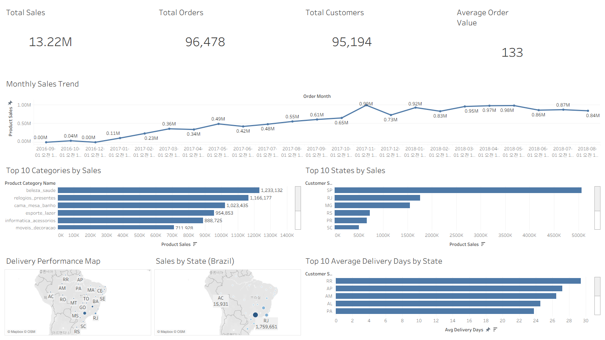
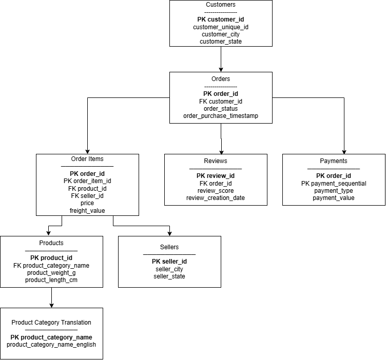

# Olist Executive Dashboard



> Executive Dashboard Overview

## 📌 Project Executive Summary

### Goal
브라질 Olist 이커머스 데이터를 활용하여 경영진(Executive)이 핵심 비즈니스 성과를 빠르게 파악하고 데이터 기반 의사결정을 내릴 수 있는 Executive Dashboard를 구축했습니다.

### Tech Stack
Python (Pandas) · SQL (SQLite) · Tableau · Jupyter Notebook

### Key Result
매출, 주문, 고객, 카테고리, 지역, 배송 데이터를 분석하여 핵심 KPI를 시각화하고, 비즈니스 인사이트를 제공하는 Executive Dashboard를 구축했습니다.

---

## Business Problem

전자상거래 기업에서는 매일 수많은 주문, 고객, 상품, 배송 데이터가 생성되지만, 데이터가 여러 영역에 분산되어 있어 경영진이 전체 비즈니스 현황을 한눈에 파악하기 어렵습니다.

본 프로젝트는 이러한 문제를 해결하기 위해 Olist Brazilian E-commerce 데이터를 통합 분석하고, 핵심 KPI를 한눈에 확인할 수 있는 Executive Dashboard를 구축했습니다.

---

## Business Questions

Dashboard를 통해 다음과 같은 핵심 비즈니스 질문에 답하고자 했습니다.

- **매출 성장성** : 현재 매출은 지속적으로 성장하고 있는가?
- **비즈니스 규모** : 고객 및 주문 규모는 어느 정도인가?
- **주요 카테고리** : 어떤 상품 카테고리가 가장 높은 매출을 기록하는가?
- **핵심 지역** : 어떤 지역(State)이 가장 높은 매출을 기록하는가?
- **운영 효율성** : 배송 성과는 지역별로 어떤 차이를 보이는가?

---

## Dataset

- **Dataset** : Olist Brazilian E-Commerce Public Dataset
- **Period** : 2016.09 ~ 2018.08
- **Database** : SQLite

### ERD



### Tables Used

- Orders
- Customers
- Order Items
- Products
- Sellers
- Payments
- Reviews
- Geolocation

---

## Project Workflow

```text
Business Problem
        ↓
Business Questions
        ↓
Data Understanding
        ↓
Data Quality Check
        ↓
KPI Design
        ↓
Dashboard Development
        ↓
Business Insights
        ↓
Business Recommendations
```

---

## Data Understanding

분석에 앞서 데이터 구조를 이해하고 각 테이블 간 관계를 확인했습니다.

주요 수행 내용

- 테이블별 역할 및 컬럼 분석
- Primary Key / Foreign Key 관계 확인
- 데이터 기간(Date Range) 확인
- 주문 상태(Order Status) 분석

---

## Data Quality Check

신뢰성 있는 분석 결과를 확보하기 위해 데이터 품질을 점검했습니다.

주요 점검 항목

- Row Count 확인
- Missing Value 확인
- Duplicate 확인
- Primary Key 무결성 검증
- Foreign Key 무결성 검증
- 날짜 범위(Date Range) 확인

---

## KPI Design

경영진이 비즈니스 성과를 빠르게 파악할 수 있도록 핵심 KPI와 주요 분석 지표를 선정했습니다.

| KPI | Business Purpose |
|------|---------|
| Total Sales | 전체 매출 규모 및 월별 성장 추이 확인 |
| Total Orders | 총 주문 건수 및 비즈니스 거래 규모 파악 |
| Total Customers | 전체 고객 규모 및 고객 기반 확인 |
| Average Order Value (AOV) | 주문 1건당 평균 구매 금액(객단가) 파악 |
| Sales by Category | 상품 카테고리별 매출 성과 분석 |
| Sales by State | 지역(State)별 매출 성과 비교 |
| Average Delivery Days | 지역별 평균 배송 기간 및 운영 효율 분석 |

---

## Dashboard

경영진이 핵심 KPI를 한 화면에서 파악할 수 있도록 다음 5개 영역으로 Dashboard를 구성했습니다.

- Executive KPI
- Monthly Sales Trend
- Sales by Product Category
- Top States by Sales
- Delivery Performance Map

이를 통해 매출, 고객, 상품, 지역, 배송 성과를 하나의 Dashboard에서 종합적으로 분석하고, 비즈니스 현황을 직관적으로 파악할 수 있도록 설계했습니다.

---

## Key Insights

- **Total Sales는 약 13.22M**으로 집계되었으며 분석 기간 동안 지속적인 성장세를 보였습니다.
- **Total Orders는 96,478건**, **Total Customers는 95,194명**으로 확인되었습니다.
- **Average Order Value(AOV)는 약 133**으로 나타났습니다.
- **São Paulo(SP)** 지역이 가장 높은 매출을 기록하며 비즈니스를 주도했습니다.
- **Beauty & Health**, **Watches & Gifts** 카테고리가 가장 높은 매출을 기록했습니다.
- 지역별 배송 기간 차이를 확인했으며, 물류 운영 효율성 개선을 위한 추가 분석 가능성을 확인했습니다.

---

## Business Recommendations

분석 결과를 바탕으로 다음과 같은 개선 방향을 제안할 수 있습니다.

- 지역별 매출 차이를 고려한 맞춤형 마케팅 전략을 검토할 수 있습니다.
- 상위 매출 카테고리를 중심으로 프로모션 및 재고 전략을 강화할 수 있습니다.
- 배송 기간이 긴 지역을 대상으로 물류 운영 프로세스를 개선할 수 있습니다.
- KPI Dashboard를 지속적으로 모니터링하여 데이터 기반 의사결정을 지원할 수 있습니다.

---

## Tech Stack

| Tool | Purpose |
|------|---------|
| Python (Pandas) | 데이터 전처리 및 KPI 계산 |
| SQL (SQLite) | 데이터 추출 및 분석 |
| Tableau | Dashboard 구축 및 데이터 시각화 |
| Jupyter Notebook | 데이터 분석 및 프로젝트 문서화 |
| Git & GitHub | 버전 관리 및 프로젝트 관리 |

---

## Repository Structure

프로젝트 분석 과정과 결과물을 다음과 같은 구조로 관리했습니다.

```text
olist-executive-dashboard
│
├── dashboard/
│   ├── Olist_Executive_Dashboard.twbx
│   └── Olist_Executive_Dashboard.png
│
├── docs/
│   └── 01_Project_Proposal.md
│
├── notebook/
│   ├── 01_data_import.ipynb
│   ├── 02_data_understanding.ipynb
│   ├── 03_data_quality.ipynb
│   ├── 04_KPI_analysis.ipynb
│   └── 05_Tableau_Dashboard.ipynb
│
├── images/
│   └── olist_erd.png
│
└── README.md
```

---

## What I Learned

이번 프로젝트를 통해 Olist Brazilian E-commerce 데이터를 활용하여 Data Understanding, Data Quality Check, KPI 설계, Tableau Dashboard 구축까지 데이터 분석 프로젝트의 전 과정을 수행했습니다.

단순히 데이터를 시각화하는 데 그치지 않고, 분석 결과를 비즈니스 관점에서 해석하여 주요 인사이트를 도출하고 구체적인 개선 방향으로 연결하는 역량을 키웠습니다.

또한 SQL과 Python(Pandas)을 활용한 데이터 추출 및 전처리, 결측치·중복·PK/FK 무결성 검증, Tableau 기반 KPI 시각화까지 직접 수행하며 각 분석 단계가 최종 분석 결과의 신뢰성과 활용도에 어떤 영향을 미치는지 이해할 수 있었습니다.

---

## Future Improvements

- Customer Segmentation 분석
- Cohort 및 Retention 분석
- Profit 기반 KPI 추가
- Dashboard 인터랙션 및 필터 기능 고도화
